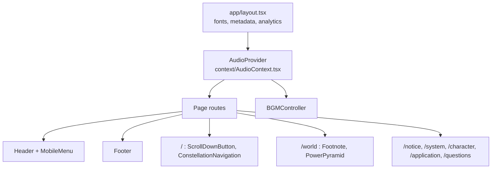

# Genesis Order

> The official rulebook and recruitment site for *Genesis Order*, a Korean original-character roleplay community with a murder-mystery plot. It's built with Next.js 14 and statically rendered.

**Site:** https://genesis-order.site

The community runs on a self-hosted Mastodon server. This site is where prospective players read the setting, the rules and the game system before they apply. It presents a long, lore-heavy Korean document as a set of readable pages, with interactive glossary footnotes, a diagram of the social hierarchy, and a navigation menu drawn as a constellation.

## Features

- **Constellation navigation.** The home page links to the six documents through an SVG "constellation" of two nested triangles. The layout is computed from trigonometry and switches geometry between desktop and mobile.
- **Interactive glossary footnotes.** On the world page, in-world terms open a positioned popover on hover (desktop) or a modal on tap (mobile). Clicking outside closes it.
- **Power pyramid.** An SVG diagram of the setting's social classes. Each level shows its description on hover, or on tap on touch devices.
- **Background music.** A React context owns one looping `Audio` instance, and a floating controller toggles playback across page navigations.
- **Responsive layout.** A scroll-aware header, a full-screen mobile menu that locks page scroll, and typography tuned for Korean text.
- **Q&A and application pages.** Collapsible Q&A accordions, plus links to the application template, the submission forms and the live status sheet.
- **Analytics.** Vercel Analytics, Vercel Speed Insights and Google Analytics (gtag).

## Tech Stack

| Area | Technology |
|---|---|
| Framework | Next.js 14 (App Router), React 18 |
| Language | TypeScript (strict) |
| Styling | Tailwind CSS 3, PostCSS, custom CSS in `app/globals.css` |
| Fonts | `next/font/google` (Noto Sans KR, Noto Serif KR, EB Garamond, Baskervville) and `next/font/local` (Pretendard, KoPub World Dotum, Proxima Nova) |
| Analytics | `@vercel/analytics`, `@vercel/speed-insights`, Google Analytics via `next/script` |
| Tooling | ESLint (`eslint-config-next`) |

## Architecture

Every route is a static page under `app/`. The root layout loads the fonts, the metadata and the analytics scripts. It also wraps the whole tree in the audio provider, so music keeps playing during client-side navigation.



| Route | Content |
|---|---|
| `/` | Landing page with the synopsis, schedule and constellation navigation |
| `/notice` | Community notices and rules |
| `/world` | Setting and history, with glossary footnotes and the power pyramid |
| `/system` | Game system (conditions, abilities, investigation, tracking, currency) |
| `/character` | Character creation guide |
| `/application` | Application form and submission links |
| `/questions` | Q&A |

## Getting Started

### Prerequisites

- Node.js 18.17 or later (required by Next.js 14)
- npm

### Installation

```bash
git clone https://github.com/eden-chang/genesis-order-website.git
cd genesis-order-website
npm ci
npm run dev
```

Then open http://localhost:3000.

### Scripts

| Command | Description |
|---|---|
| `npm run dev` | Start the development server on port 3000 |
| `npm run dev:3006` | Start the development server on port 3006 |
| `npm run build` | Create a production build (all routes are prerendered as static pages) |
| `npm start` | Serve the production build |
| `npm run lint` | Run ESLint |

## Environment Variables

None. The site has no runtime configuration. The Google Analytics measurement ID is public and set in `app/layout.tsx`.

## Project Structure

```
app/                  Routes (App Router) and global styles
  layout.tsx          Root layout: fonts, metadata, analytics, audio provider
  page.tsx            Landing page
  notice/ world/ system/ character/ application/ questions/
components/
  content/Footnote.tsx            Glossary footnote popover / modal
  layout/Header.tsx, MobileMenu.tsx, Footer.tsx
  ui/ConstellationNavigation.tsx  SVG home navigation
  ui/PowerPyramid.tsx             SVG social-hierarchy diagram
  ui/BGMController.tsx            Floating music toggle
  ui/ScrollDownButton.tsx
context/AudioContext.tsx          Shared background-music state
public/               Fonts, images, audio
docs/PROJECT_PLAN.md  Original planning document (Korean)
```

All page content is written directly in the route components.

## Deployment

The site is deployed on Vercel, which the Vercel Analytics and Speed Insights integrations need. Any Next.js host that can serve a static build will also work.
